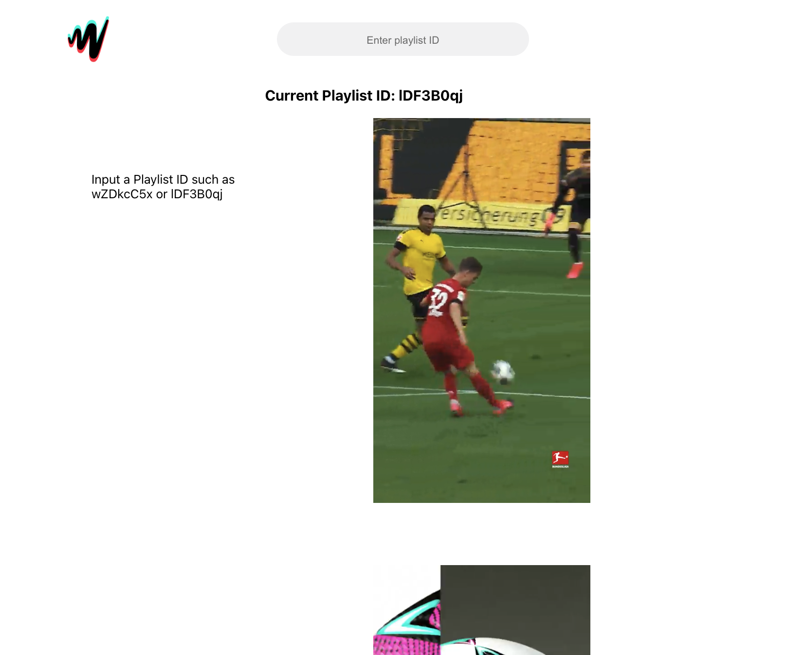

# JW TikTok Webapp

HackWeek 2023

This is a front-end React application that mimics TikTok while using JWP's API to feed content by playlist ID.  

## Requirements

At this stage all that is needed is a playlist ID

## Getting Started
* Clone down this repo
* `npm start`

    * Runs the app in the development mode.\
Open [http://localhost:3000](http://localhost:3000) to view it in your browser.
* Input playlist ID into search bar at top of app
    * needs logic to catch invalid playlist IDs
## Resources

* jwplayer-react
* react-infinite-scroll-component

## Still Need
* Develop into own module/package 
* Functionality for endpoints for likes, shares, etc. 
